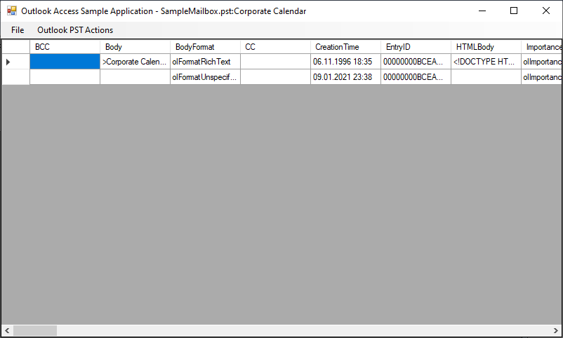
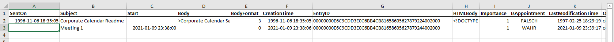

# CompuMaster.Data.Outlook
Simplified access to **Outlook PST** files with performant data transfer (reduced roundtrips to server)
based on NetOffice.OutlookApi (requires installed MS Outlook)

[](https://github.com/CompuMasterGmbH/CompuMaster.Data.Outlook/releases) 
[](https://www.nuget.org/packages/CompuMaster.Data.Outlook/) 

## Sample application

* Sample application for quick starting your own development  

* Sample extraction of MS Outlook calendar entries into Microsoft Excel XLSX file (works for CSV files, too)


## Sample code (VB.NET)
It's easy to browse and access all folders of Outlook's PST fiels, it takes just a few lines of code (also see sample console/debug app)  
```vb.net
Sub Main()
    Dim OutlookApp As New CompuMaster.Data.Outlook.OutlookApp(12)
    Try
        Dim PstRootFolderPath As CompuMaster.Data.Outlook.FolderPathRepresentation 
        PstRootFolderPath = OutlookApp.LookupRootFolder(System.IO.Path.Combine(My.Application.Info.DirectoryPath, "SampleData", "Mailbox.pst"))
        PstRootFolderPath.Directory.ForDirectoryAndEachSubDirectory(
            Sub(dir As CompuMaster.Data.Outlook.Directory)
                Console.Write(dir.Path)
                Console.Write(" (SubFolders:" & dir.SubFolderCount & " / UnReadItems:" & dir.ItemUnreadCount & " / TotalItems:" & dir.ItemCount & ")")
                Console.WriteLine()
                ShowItems_FormatTable(dir)
            End Sub)
    Finally
        OutlookApp.Application.Quit()
    End Try
End Sub

'Following method requires CompuMaster.Data library (see NuGet gallery) to render DataTable nicely for command line output
Private Sub ShowItems_FormatTable(dir As CompuMaster.Data.Outlook.Directory)
    Dim FolderItems As System.Data.DataTable = dir.ItemsAllAsDataTable
    CompuMaster.Data.DataTables.RemoveColumns(FolderItems, New String() {"Body", "HTMLBody", "RTFBody"}) 'Do not show multi-line fields following steps
    CompuMaster.Data.DataTables.RemoveColumns(FolderItems, New String() {"ParentFolderID", "EntryID"}) 'Do not show ID fields in following steps
    Console.WriteLine(CompuMaster.Data.DataTables.ConvertToPlainTextTableFixedColumnWidths(FolderItems))
End Sub

```
